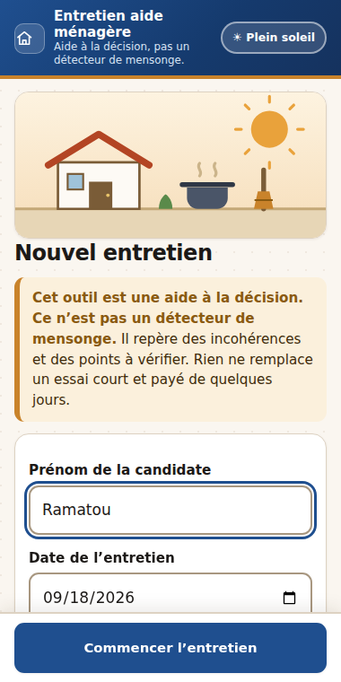
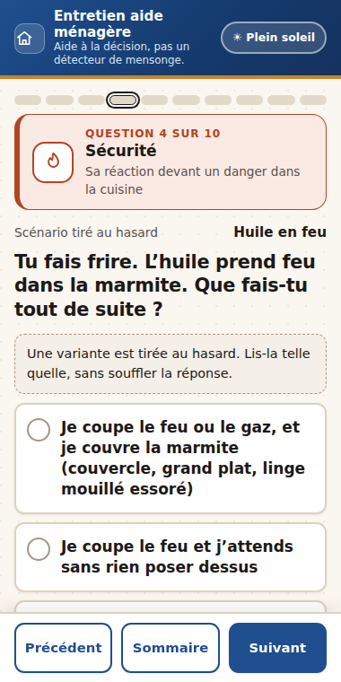
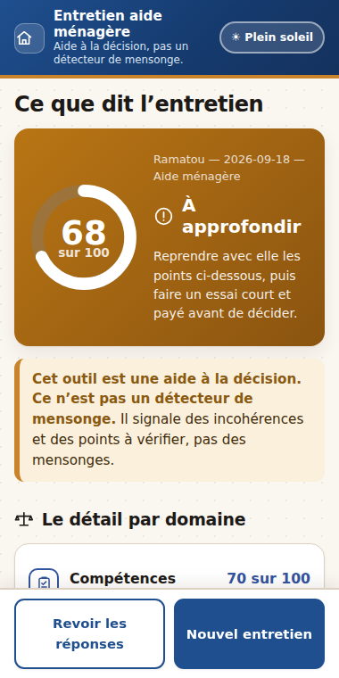

<h1 align="center">Entretien aide ménagère</h1>

<p align="center">
  Un outil d'aide à l'entretien d'embauche des <b>aides ménagères</b> et <b>aides cuisinières</b>,
  pensé pour les familles de Niamey.<br>
  Dix questions posées à l'oral, un score, et la liste de ce qu'il reste à faire avant d'embaucher.
</p>

<p align="center">
  
  
  
</p>

> [!IMPORTANT]
> **Cet outil est une aide à la décision, pas un détecteur de mensonge.**
> Il repère des incohérences et des points à vérifier. Rien ne remplace un essai court et payé de quelques jours.

---

## Pourquoi

À Niamey, l'entretien se résume souvent à « sais-tu cuisiner ? ». La famille découvre après l'embauche des
compétences surévaluées, des gestes dangereux dans la cuisine ou des départs brusques.

Cet outil donne à l'employeur une trame : les mêmes dix questions pour toutes les candidates, des scénarios
concrets tirés au hasard, et un compte rendu écrit qu'on peut relire, imprimer et comparer.

## Utiliser l'app

| | |
|---|---|
| **En ligne** | https://blakro.github.io/recrutement-aide-menagere/ *(après activation de GitHub Pages)* |
| **Hors ligne** | Télécharger `index.html` et l'ouvrir dans le navigateur du téléphone |
| **Sur le téléphone** | Ouvrir le lien, puis « Ajouter à l'écran d'accueil » |

Une fois la page chargée, tout fonctionne sans réseau. Les réponses restent sur le téléphone.

## Les dix questions

| | Question | Ce qu'elle regarde | Sous-score |
|---:|---|---|---|
| 1 | Compétences déclarées | Ce qu'elle dit savoir faire dans la maison | Compétences |
| 2 | Démonstration orale | Sa façon d'expliquer une tâche, étape par étape | Compétences · Cohérence |
| 3 | Hygiène alimentaire | Son hygiène pour la nourriture et pour l'eau | Hygiène & sécurité |
| 4 | Sécurité | Sa réaction devant un danger dans la cuisine | Hygiène & sécurité |
| 5 | Règles de la maison | Le respect des règles de la maison | Intégrité |
| 6 | Intégrité | Son honnêteté devant une tentation | Intégrité |
| 7 | Produit fictif | Sa réaction devant un produit qui n'existe pas | Cohérence |
| 8 | Désirabilité sociale | Sa façon de parler de ses propres erreurs | Cohérence |
| 9 | Disponibilité | Ce qu'il faut pour qu'elle soit là chaque jour | Stabilité |
| 10 | Projet et congés | Le temps qu'elle compte rester et ses congés | Stabilité · Cohérence |

Trois mécanismes font le travail :

- **Les questions en miroir.** Une compétence annoncée doit pouvoir s'expliquer étape par étape. Ce qu'elle
  promet sur la durée doit tenir avec les heures qu'elle peut faire.
- **Les scénarios tirés au hasard.** L'huile qui prend feu, l'odeur de gaz, le billet trouvé sous le lit, le
  verre cassé. La variante change d'une candidate à l'autre, pour que les réponses ne circulent pas.
- **Le produit qui n'existe pas.** Dire qu'on le connaît ne prouve pas un mensonge, mais signale que les
  compétences annoncées demandent toutes à être vérifiées. Le nom se change dans les Réglages.

Une **épreuve pratique** facultative complète l'entretien : cinq gestes observés, notés réussi, partiel,
non fait ou non observé.

## Le score

Cinq sous-scores sur 100, pondérés selon le poste :

| Poste | Compétences | Hygiène & sécurité | Intégrité | Cohérence | Stabilité |
|---|---:|---:|---:|---:|---:|
| Aide ménagère | 25 | 20 | 25 | 15 | 15 |
| Aide cuisinière | 25 | 30 | 20 | 15 | 10 |
| Polyvalente | 25 | 25 | 20 | 15 | 15 |

Le total donne un verdict : **période d'essai recommandée** à partir de 70, **à approfondir** entre 50 et 69,
**non recommandé** en dessous. Un drapeau bloquant ramène le verdict à « à approfondir » au mieux ; deux
drapeaux bloquants, ou trois drapeaux légers, pèsent davantage.

Ces seuils sont des valeurs de départ, à recalibrer après une quinzaine d'entretiens réels.

## Ce que l'app ne fait pas

- **Aucune question sur les employeurs précédents**, et aucune demande de citer une personne de référence :
  les joindre est rarement possible ici, et une candidate n'a pas à être notée sur des gens qu'on n'appellera
  pas. La vérification passe par l'essai payé, le seul contrôle qui dépende de l'employeur.
- **Aucune question sur la garde d'enfants** : c'est un autre métier, hors périmètre.
- **Aucun numéro de pièce d'identité, aucune photo.**
- **Aucun serveur, aucun compte.** Rien ne sort du téléphone tant que l'employeur n'exporte pas lui-même.

## Équité

Le score ne dépend **jamais** de la situation familiale, de la nationalité, de l'ethnie, de la religion ni de
la langue parlée pendant l'entretien. Techniquement, la fiche de la candidate n'est jamais transmise au calcul,
pas même les notes libres : un test automatique injecte de fausses données personnelles à chaque modification
et vérifie que le résultat ne bouge pas.

La candidate répond dans la langue qu'elle veut. L'app est en français, mais le barème note ce qu'elle dit,
jamais son vocabulaire ni sa langue. Des traductions zarma et haoussa ont été rédigées puis mises de côté,
faute de relecture par des locuteurs natifs : elles restent dans [`docs/QUESTIONS.md`](docs/QUESTIONS.md).

## Vie privée

Les réponses restent sur le téléphone de l'employeur, dans un historique local qu'on peut effacer d'un bouton.
Les exports JSON et CSV sont des téléchargements locaux, et le dépôt refuse de les committer.
Prévenir la candidate que ses réponses sont notées : l'app affiche le texte à lire avant de commencer.

## Développement

Un seul fichier `index.html` à la racine : HTML, CSS et JavaScript intégrés, sans build, sans dépendance,
sans CDN et sans police externe. Les illustrations sont des SVG écrits dans le fichier.

```sh
node tests/run-selftest.mjs     # tests du barème (Node ≥ 18, sans dépendance)
python3 -m http.server 8000     # aperçu local sur http://localhost:8000
```

`index.html?selftest=1` lance les mêmes tests dans le navigateur.

| Document | Contenu |
|---|---|
| [`CLAUDE.md`](CLAUDE.md) | Contraintes du projet et façon de travailler |
| [`docs/SPEC.md`](docs/SPEC.md) | Spécification complète et contrat technique |
| [`docs/QUESTIONS.md`](docs/QUESTIONS.md) | Les dix questions, leurs options, leurs points et leurs drapeaux |
| [`docs/ROADMAP.md`](docs/ROADMAP.md) | Ce qui reste à faire |

Développé avec [Claude Code](https://claude.com/claude-code).

## Licence

[MIT](LICENSE)
